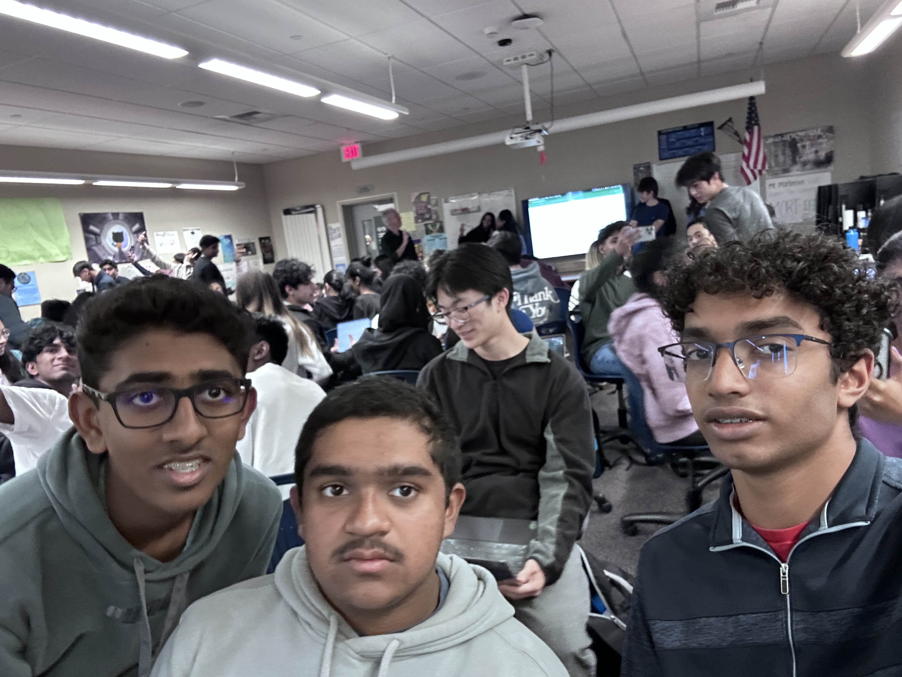

# Communication and Workflow
Agile methodology improves communication and helps teams stay organized. Flowcharts or user diagrams make it easier to explain website navigation, while Git is essential for collaboration, especially in tech companies like Northrop Grumman.

Apply Agile principles in class projects or clubs by holding daily check-ins to track progress. Use tools like Lucidchart to map user journeys, and practice Git during group or personal coding projects. This shows teamwork and technical skills during interviews.

# Roles and Experiences in Engineering
Engineering classes often use roles like Scrum Master and Design Lead, which keep projects organized, but these roles are rare in clubs. Hackathons simulate real-world development with defined roles like frontend, backend, and repository management.

Introduce similar roles in club projects to mimic professional workflows and include peer reviews for accountability. Hackathons offer hands-on coding experience in teams—highlight these experiences in your portfolio to show technical and collaborative skills.

# Technical Knowledge
Dijkstra’s algorithm, used in Google Maps, calculates the shortest path between two points. This involves APIs and connecting frontend and backend systems.

Apply these skills by creating a simple route planner using Dijkstra’s algorithm with a mapping API. This type of project is a practical way to develop problem-solving skills and build your portfolio.

# Academics and Advanced Planning
Top schools like Purdue, ranked highly in aerospace engineering, offer fast-track programs where you can complete a bachelor’s in three years and a master’s in four. This requires taking enough AP or community college classes.

Plan your AP courses and consider taking community college classes to save time and money. Research credit transfer policies at your target universities to make the most of these efforts.

# Essays and Applications
College essays should focus on projects and extracurriculars related to your major. Highlight your passions and mention specific programs or professors at your target schools to show genuine interest.

Research the unique features of each university and tie them to your goals. Use examples from your experiences to show leadership, technical skills, and dedication to your field.

# Networking and Internships
Building connections can lead to internship referrals. LinkedIn is a great tool for finding opportunities—search companies, explore careers pages, and apply. A strong portfolio showcasing projects is essential for standing out. Internships don’t always need to match your major exactly; they can still provide valuable skills.

Join clubs and engage in online communities to grow your network. Create a professional LinkedIn profile and an online portfolio to display your work and accomplishments.

# Extracurriculars and Passions
Focus on clubs and activities that reflect your passions, like Science Olympiad or F1 competitions. Extracurriculars should demonstrate genuine interest while building relevant skills.

Choose clubs that align with your goals and use these experiences to stand out in essays and interviews. Highlight how these activities helped develop teamwork, problem-solving, or leadership skills.

# Academic and Professional Focus
In high school, prioritize grades to get into a good college. In college, shift focus to projects and practical experiences, as these are more important for internships and jobs. Coding is a key skill across many majors, so start building this early.

Balance a strong GPA with meaningful projects. In college, focus on creating a portfolio of hands-on work that showcases your problem-solving and technical abilities, which are critical for future opportunities.

